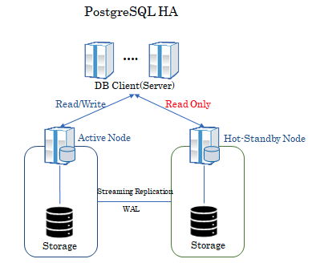

# HA

## 클러스터 vs 레플리케이션

클러스터는 기본적으로 Multi-Master 구조로, 모든 노드가 읽기 및 쓰기 작업을 수행할 수 있기 때문에  기본적으로 높은 가용성과 병렬 처리가 가능하지만, 데이터 일관성 유지를 위한 복잡한 문제를 일으킬 수 있다. 또한, 모든 마스터 노드가 일관된 상태를 유지해야 하므로, 데이터가 동시에 여러 위치에서 변경될 때 충돌이 발생할 수 있다.

Replication 구조는 일반적으로 Single-Pirmary와 하나 이상의 Standby로 구성된다. 모든 쓰기 작업은 Master에서 이루어지고, Slave는 읽기 작업과 가용성을 위한 백업 역할을 한다. 이 구조는 데이터 일관성 유지가 비교적 쉽지만, Master가 실패하면 복구 시간 동안 쓰기 작업이 중단될 수 있다. 다만, 자동 Failover 설정을 통해 다른 Slave를 Master로 승격시키는 방법으로 이 문제를 완화할 수 있다.

## Replication 방식

- WAL(Write Ahead Log) 기반 Physical Replication 방식
    - WAL: DB 변경 사항을 저장한 Log
        - Log Shipping: WAL 파일 자체를 전달하는 방식
        - Streaming: 로그 내용을 전달하는 방식
    - DB의 모든 변경 사항을 물리적으로 복제
    - Standby 서버는 Primary 서버의 정확한 복사본이 됨
    - HA 및 DR의 용도
- Logical Replication
    - 복제 식별자(PK)를 기반으로 변경 사항을 복제하는 방식 (블록 address 를 바이트 단위로 복제하는 physical replication과 반대 개념)
    - Pirmary 서버에서 발생하는 변경사항을 선택적으로 복제 가능
        - 뿐만 아니라, 다른 버전의 PostgreSQL 로도 복제 가능
        - 운영 중인 DB를 새 버전으로 마이그레이션 할 때 사용
    - pub sub 모델 사용
        - 변경 사항을 synchronization worker가 감지