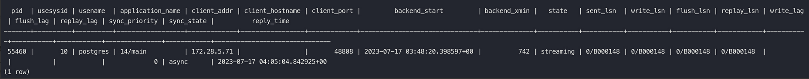
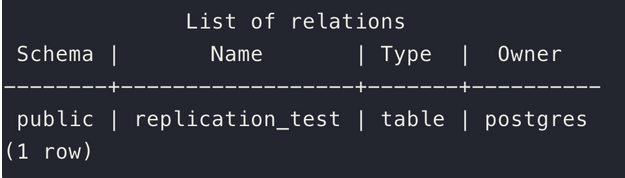
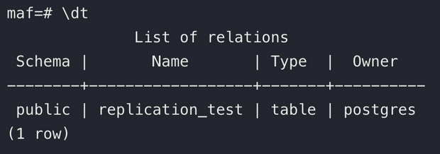
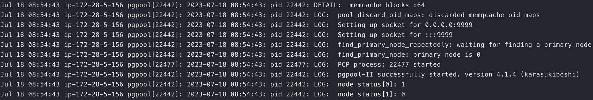
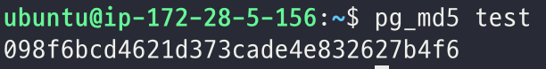
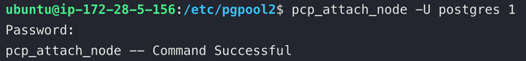
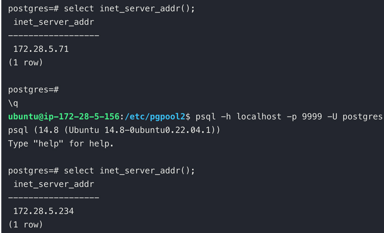

# PostgreSQL HA

## 클러스터 vs 레플리케이션

클러스터는 기본적으로 멀티 마스터 구조로, 모든 노드가 읽기 및 쓰기 작업을 수행할 수 있기 때문에  기본적으로 높은 가용성과 병렬 처리가 가능하지만, 데이터 일관성 유지를 위한 복잡한 문제를 일으킬 수 있다. 또한, 모든 마스터 노드가 일관된 상태를 유지해야 하므로, 데이터가 동시에 여러 위치에서 변경될 때 충돌이 발생할 수 있다.

Replication 구조는 일반적으로 마스터와 하나 이상의 슬레이브로 구성된다. 모든 쓰기 작업은 마스터에서 이루어지고, 슬레이브는 읽기 작업과 가용성을 위한 백업 역할을 한다. 이 구조는 데이터 일관성 유지가 비교적 쉽지만, 마스터가 실패하면 복구 시간 동안 쓰기 작업이 중단될 수 있다. 다만, auto failover 설정을 통해 다른 슬레이브를 마스터로 승격시키는 방법으로 이 문제를 완화할 수 있다.

## Replication 방식


- WAL(Write Ahead Log) 기반 Physical Replication 방식
    - WAL: DB 변경 사항을 저장한 Log
        - Log Shipping: WAL 파일 자체를 전달하는 방식
        - Streaming: 로그 내용을 전달하는 방식
    - DB의 모든 변경 사항을 물리적으로 복제
    - Standby 서버는 Primary 서버의 정확한 복사본이 됨
    - HA 및 DR의 용도
- Logical Replication
    - 복제 식별자(PK)를 기반으로 변경 사항을 복제하는 방식 (블록 address 를 바이트 단위로 복제하는 physical replication과 반대 개념)
    - Pirmary 서버에서 발생하는 변경사항을 선택적으로 복제 가능
        - 뿐만 아니라, 다른 버전의 PostgreSQL 로도 복제 가능
        - 운영 중인 DB를 새 버전으로 마이그레이션 할 때 사용
    - pub sub 모델 사용
        - 변경 사항을 synchronization worker가 감지

## Pgpool-II
PostgreSQL 의 HA 를 구성할 때, auto failover 를 구성할 수 있는 선택지 중 하나이다. 뿐만 아니라, load balancing, connection pool 등의 기능도 제공하고 있다.

Pgpool 이 클라이언트 요청을 DB 서버로 분배하는 동작 모드는 다음과 같다.
- Load Balance mode: 읽기 쿼리를 여러 PostgreSQL 서버에 분산하여 요청한다.
  - `statement_level_load_balance` 값에 따라 load balancing 전략이 조금 달라진다. on 이면 매 쿼리마다 요청하는 DB 서버가 달라지고, off 이면 세션을 연결할 때 쿼리를 요청할 DB가 결정된다. 
- Master/Slave mode: 쓰기 쿼리는 마스터 서버에, 읽기 쿼리는 슬레이브 서버에 라우팅한다.
- Replication mode: 여러 PostgreSQL 서버가 같은 데이터를 가지도록 분산 복제 저장한다.

### Pgpool 은 어떤 DB가 마스터인지 어떻게 알 수 있을까?
위의 기능들을 보면 Pgpool은 마스터를 감지하여 쿼리를 라우팅한다. 
이는 `pgpool.conf`의 `backend_hostname` 에 명시되어 있는 PostgreSQL 인스턴스에 따라 구분한다. 해당 설정에서 첫 번째로 명시된 호스트를 마스터로 간주한다.

### Replication mode 와 WAL-based-replication은 무엇이 다른걸까?
Pgpool 이 제공하는 Replication mode 는 statement 기반으로 작동한다. 

즉, 클라이언트로 부터 받은 쿼리를 모든 DB 서버에 전달하는 것으로, 서버의 변경 사항을 전달하는  WAL-based-replication 과는 차이가 있다. 


### Watchdog
Pgpool 역시 SPOF(Signe Point of Failure)가 될 수 있다. 이를 위해 Pgppol 노드를 추가하여 HA를 구성해야 할 필요가 있는데, 이를 수행해 주는 것이 Watchdog이다. 

기본적으로, keepalived 와 유사하게 Pgpool 인스턴스 간 heartbeat check를 통해 VIP를 이전하는 active-stand by 구조이다.

    
## HA 구성 Example
Replication WAL Streaming 방식으로 Master(read, write)-Slave(read only) 을 구성하고, Pgpool2를 통해 auto failover 를 구성하는 방식이다.

os: ubuntu

PosgreSQL 버전: 14

### PostgreSQL 설치

- postgreSQL 설치
    - `sudo apt-get install postgresql-14 -y`
- postgres 비밀 번호 test로 변경
    - `sudo -iu postgres psql -c "ALTER USER postgres WITH PASSWORD 'test';"`
- `pg_hba.conf` 수정
    - 디폴트 설정으로 모든 외부 connection 차단되어 있다. 외부 connection을 허용해야 한다.
        ```bash
        host    all             all             0.0.0.0/0               md5
        host    all             all             ::/0                    md5
        ```
        
- `postgresql.conf` 수정
    - `listen address`의 주석을 풀어 listen 을 허용해줘야 한다.

### Replication 설정

- 마스터
    - **WAL 아카이브 활성화:**
        - WAL(Write Ahead Log) 는 변경 내용을 설명하는 로그 레코드를 영구적 저장소에 먼저 기록한 후에 데이터 파일의 변경 내용을 작성하여 무결성을 보장한다.
        - 마스터의 **`postgresql.conf`** 파일에서 아래의 설정을 활성화한다.
            
            ```bash
            wal_level = replica
            max_wal_senders = 5  # 동시 연결 복제 서버 최대 개수
            max_replication_slots = 10 # 복제 슬롯 최대 개수
            max_wal_size = 10GB # 
            hot_standby = on
            ```
            
        - `max_replication_slot`과 `max_wal_senders` 는 독립적으로 사용될 수 있다. 복제 서버마다 슬롯을 할당할 수도 있지만, 슬롯을 공유할 수도 있다.
        - streaming replication은 기본적으로 `async` 방식으로 동작한다.
          - async vs sync
              - 복제의 안정성과 성능의 trade off
              - async: 마스터는 트랜잭션을 커밋하고 클라이언트에 바로 반환 후, WAL 레코드를 전송. 마스터의 응답시간은 빠르나 복제가 지연되거나 실패하는 경우 데이터 손실이 발생할 수 있다.
              - sync: WAL 레코드부터 전송하고 슬레이브가 복제를 한 이후에 클라이언트에 커밋 결과를 반환. 마스터와 슬레이브의 데이터가 항상 일치하지만, 그 만큼 결과 반환이 늦어지므로 성능은 내려간다.
    - 슬레이브에서의 접근 허용
        - 마스터의 **`pg_hba.conf`** 파일에 슬레이브의 접근을 허용하는 항목을 추가한다.
            
            ```bash
            host replication all [슬레이브 IP 주소]/32 trust
            ```
            
    - PostgreSQL 을 재시작한다.
        - `sudo systemctl restart postgresql`
- 슬레이브
    - `postgres` 유저로 스위치 한다.
        - `sudo su postgres`
    - `data_directory` 내의 내용을 삭제한다.
        - `show data_directory;` : data directory 위치를 알려준다.
        - 보존해야할 데이터가 있다면 미리 백업을 해두어야 한다.
        - `rm -r /var/lib/postgresql/14/main/`
    - 마스터의 데이터를 가져온다.
    - `pg_basebackup -D /var/lib/postgresql/14/main/ -h [마스터 IP 주소] -p 5432 -Xs -R -P`
        
        ```bash
        -D = data directory
        
        -h  = IP address of primary server
        
        -p = Port on which primary instance is running
        
        -Xs = WAL method - stream
        
        -P = Progress information
        
        --slot=SLOTNAME  #optional
        
        -R = Write configuration parameters for replication
        ```
        
    - PostgreSQL을 재시작한다.
        - `sudo systemctl restart postgresql`
- 확인
    - replication 프로세스가 작동 되고 있는지 마스터에서 확인한다.
        - `SELECT * FROM pg_stat_replication;`
            
            
            
    - WAL Streaming 방식은 물리적 복제 방식으로, 데이터베이스 레벨의 변경만을 동기화하며, **데이터베이스 생성 및 삭제와 같은 클러스터 레벨**의 DDL 작업은 동기화하지 않는다.
    - 마스터에서 테이블을 하나 생성하고, 슬레이브에도 동기화가 되었는지 확인한다.
        - 마스터

            
            
        - 슬레이브

            
            
    - 슬레이브는 **read-only**이기 때문에 슬레이브에서 Write를 시도하면 fail 이 발생한다.
        
        

### **Pgpool-II** 구성 ([docs](https://www.pgpool.net/docs/latest/en/html/index.html))

- 제공기능
    - Connection Pooling
    - Load Balancing
    - Automated fail over
    - Replication
- sub process
    - PCP
        - CLI
        - Pgpool Control Program
        - 서버 상태 확인, 연결 종료, 노드 추가 및 제거 등 작업을 원격으로 가능하게 한다.
    - Watchdog (여기서는 사용하지 않는다.)
        - Pgpool 역시 SPOF(Signe Point of Failure)가 될 수 있기 때문에, 이를 위해 Pgppol 노드를 추가하여 HA를 구성해야 할 필요가 있다. 이를 수행해 주는 것이 Watchdog.
        - 기본적으로, keepalived 와 유사하게 Pgpool 인스턴스 간 heartbeat check를 통해 VIP를 이전하는 active-stand by 구조이다.
- inbound 방화벽 구성
    - 9999: [Pgpool](https://www.pgpool.net/docs/42/en/html/runtime-config-connection.html#GUC-PORT) port
    - 9898: [PCP](https://www.pgpool.net/docs/42/en/html/runtime-config-connection.html#GUC-PCP-PORT) port
    - 9000: [watchdog](https://www.pgpool.net/docs/42/en/html/runtime-watchdog-config.html#GUC-WD-PORT) port(사용 시)
- Pgpool2 설치
    - `apt install -y pgpool2 postgresql-14-pgpool2`
    - Pgpool 은 프록시일 뿐이지만 psql과 같은  명령어 사용을 위해 PostgreSQL 설치가 필요하다.
- `/etc/pgpool2/pgpool.conf` 설정([man page](https://www.pgpool.net/docs/42/en/html/runtime-config.html) 참고)
    
    ```bash
    listen_addresses = '*'
    
    port = 9999 # Pgpool port
    
    backend_hostname0 = '[마스터 IP 주소]' 
    backend_port0 = 5432
    backend_weight0 = 1
    backend_data_directory0 = '/var/lib/postgresql/14/main'
    backend_flag0 = 'ALLOW_TO_FAILOVER'
    backend_application_name0 = 'server0'
    
    backend_hostname1 = '[슬레이브 IP 주소]'
    backend_port1 = 5432
    backend_weight1 = 1
    backend_data_directory1 = '/var/lib/postgresql/14/main'
    backend_flag1 = 'ALLOW_TO_FAILOVER'
    backend_application_name1 = 'server1'
    
    sr_check_user = 'postgres'
    sr_check_password = 'makina'
    sr_check_database = '[DB 이름]'
    
    health_check_period = 5 # 단위 초
    health_check_timeout = 5 # 단위 초
    
    health_check_user = 'postgres'
    health_check_password = 'makina'
    health_check_database = '[DB 이름]'
    health_check_max_retries = 3
    ```
    
- 모드 설정
    - Pgpool 이 클라이언트 요청을 DB 서버로 분배하는 동작 모드는 다음과 같다.
        - Load Balance mode: 읽기 쿼리를 여러 PostgreSQL 서버에 분산하여 요청한다.
            - `statement_level_load_balance` 값에 따라 load balancing 전략이 조금 달라진다. on 이면 매 쿼리마다 요청하는 DB 서버가 달라지고, off 이면 세션을 연결할 때 쿼리를 요청할 DB가 결정된다.
        - Master/Slave mode: 쓰기 쿼리는 마스터 서버에, 읽기 쿼리는 슬레이브 서버에 라우팅한다.
        - Replication mode: 여러 PostgreSQL 서버가 같은 데이터를 가지도록 분산 복제 저장한다.
            - Pgpool 이 제공하는 Replication mode 는 statement 기반으로, WAL을 전달하여 복제하는 방식과는 차이가 있다.
    - 여기서는 Load Balance mode와 Master/Slave mode를 사용한다. 
    `/etc/pgpool2/pgpool.conf` 를 추가로 설정한다.
    
    ```bash
    load_balance_mode = on
    
    master_slave_mode = on
    ```
    
- 연결된 데이터베이스에서 Pgpool의 접근을 허용해야 한다.
    - DB 서버들의 `pg_hba.conf`에 아래 레코드를 추가한다. 오버라이드가 되기 때문에 `0.0.0.0/0` 레코드 위에 명시해야 한다.
        
        ```bash
        **host    all             all             [Pgpool IP 주소]         trust**
        host    all             all             0.0.0.0/0               md5
        ```
        
- Pgpool2 재시작
    - `sudo systemctl restart pgpool2.service`
- 연결된 PostgreSQL 확인
    - `systemctl status pgpool2.service`

        
        
    - 로그를 보면 `node[0]`(마스터) 는 1로 on 상태이지만, `node[1]`(슬레이브)는 0으로 off상태이다.
- off 상태의 node 부착
    - `pcp_attach_node` 를 통해 노드를 부착할 수 있다.
    - 해당 명령어를 사용하려면 `pcp.conf` 에 정의된 사용자로 인증해야 한다.
    - `/etc/pgpool2/pcp.conf`에 다음과 `username:pasword`를 저장한다.
    - password 는 `md5`로 해싱된 값을 입력해야 하고, 해싱된 값은 `pg_md5` 명령어로 얻을 수 있다.
    - `test`를  해싱하여 저장하는 예시입니다.

        
        
        ```bash
        postgres:098f6bcd4621d373cade4e832627b4f6
        ```
        
    - 저장을 하고 pgpool2를 재시작하면 `pcp_attach_node` 명령어를 사용할 수 있다.
        
        
- 연결된 PostgreSQL 확인
    - `load_balance_mode`를 사용했기 때문에 db 세션을 맺을 때 두 서버 중 하나에 붙는다.
    
        
        
- failover script 작성
    - 마스터가 다운되면 슬레이브를 마스터로 승격시킬 수 있어야 한다.
    - 마스터가 fail 하면 슬레이브에 `pg_ctl promote` 명령어를 날려 새로운 마스터로 승격시킨다.
    - 아래 스크립트가 정상 작동 하기 위해서는 Pgpool 에서 양쪽 DB 서버와 공유하는 ssh 키가 있어야 한다. ([참고](https://hbase.tistory.com/9))
    - `failover.sh`
        
        ```bash
        #!/bin/bash
        
        # This script is run by failover_command.
        
        set -o xtrace
        exec > >(logger -i -p local1.info) 2>&1
        
        # Special values:
        #   %d = failed node id
        #   %h = failed node hostname
        #   %p = failed node port number
        #   %D = failed node database cluster path
        #   %m = new master node id
        #   %H = new master node hostname
        #   %M = old master node id
        #   %P = old primary node id
        #   %r = new master port number
        #   %R = new master database cluster path
        #   %N = old primary node hostname
        #   %S = old primary node port number
        #   %% = '%' character
        
        FAILED_NODE_ID="$1"
        FAILED_NODE_HOST="$2"
        NEW_MASTER_NODE_ID="$3"
        NEW_MASTER_NODE_HOST="$4"
        OLD_MASTER_NODE_ID="$5"
        
        if [ $# -ne 4 ]
        then
                echo "failover failed_node new_master trigger_file"
                exit 1
        fi
        
        logger -i -p local1.info failover.sh: start: failed_node_id=$FAILED_NODE_ID failed_host=$FAILED_NODE_HOST new_master_host=$NEW_MASTER_NODE_HOST
        
        ## If there's no master node anymore, skip failover.
        if [ $NEW_MASTER_NODE_ID -lt 0 ]; then
            logger -i -p local1.info failover.sh: All nodes are down. Skipping failover.
            exit 0
        fi
        
        ## If Standby node is down, skip failover.
        if [ $FAILED_NODE_ID -ne $OLD_PRIMARY_NODE_ID ]; then
            logger -i -p local1.info failover.sh: Standby node is down. Skipping failover.
            exit 0
        fi
        
        ## Promote Standby node.
        logger -i -p local1.info failover.sh: Primary node is down, promote standby node ${NEW_MASTER_NODE_HOST}.
        
        ssh -T ${NEW_MASTER_NODE_HOST} -i=/etc/pgpool2/maf.pem "sudo -u postgres /usr/lib/postgresql/14/bin/pg_ctl promote -D /var/lib/postgresql/14/main/"
        
        logger -i -p local1.info failover.sh: end: new_master_node_id=$NEW_MASTER_NODE_ID started as the master node
        exit 0
        ```
        
- 기존의 마스터가 장애를 극복하면, 데이터를 동기화하고 슬레이브로서 동작해야 한다.
    - `data directory`에 있는 내용을 삭제하고, 동기화를 받는다.
        - `rm -r /var/lib/postgresql/14/main/`
        - `pg_basebackup -D /var/lib/postgresql/14/main/ -h [마스터 IP 주소] -p 5432 -Xs -R -P`
    - PostgreSQL 을 가동한다.
        - `sudo systemctl start postgresql`
- 복구된  PostgreSQL 을  pgpool 에 붙는지 확인한다.
    - 자동으로 붙지 못하면 `pcp_attach_node` 를 통해 붙여줘야 한다.
    
