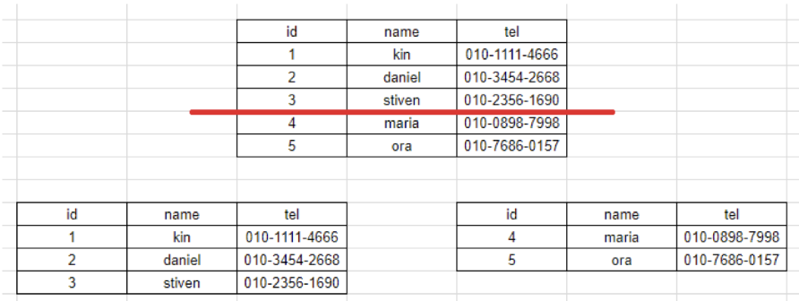

# DB 파티셔닝
큰 table이나 index를, 관리하기 쉬운 partition이라는 작은 단위로 물리적으로 분할하는 것을 의미한다.
물리적인 데이터 분할이 있더라도, DB에 접근하는 application의 입장에서는 이를 인식하지 못한다.

DB 파티셔닝(Partitioning)의 장단점
- 장점
    - 관리적 측면 : partition 단위 백업, 추가, 삭제, 변경
        - 전체 데이터를 손실할 가능성이 줄어들어 데이터 가용성이 향상된다.
        - partition별로 백업 및 복구가 가능하다.
        - partition 단위로 I/O 분산이 가능하여 UPDATE 성능을 향상시킨다.
    - 성능적 측면 : partition 단위 조회 및 DML수행
        - 데이터 전체 검색 시 필요한 부분만 탐색해 성능이 증가한다.
        - 즉, Full Scan에서 데이터 Access의 범위를 줄여 성능 향상을 가져온다.
        - 필요한 데이터만 빠르게 조회할 수 있기 때문에 쿼리 자체가 가볍다.
- 단점
    - table간 JOIN에 대한 비용이 증가한다.
    - table과 index를 별도로 파티셔닝할 수 없다.
    - table과 index를 같이 파티셔닝해야 한다.

수평 파티셔닝


파티션 프루닝

쿼리의 WHERE 절에 따라 필요한 파티션만을 선택적으로 액세스하는 과정

파티셔닝을 하지 않던 시계열 데이터를 월 파티셔닝을 걸면 full-scan 비용이 얼마나 절약될까?

파티션 프루닝 덕분에, 특정 범위의 데이터를 조회하면 해당 데이터가 존재하는 테이블에만 조회하기 때문에 조회 성능이 비약적으로 상승한다. 그렇다면 데이터가 고르게 분포한다는 가정하에, 성능이 얼마나 상승할까? 

예를 들어 다음과 같은 쿼리가 있다.
```sql
SELECT *
FROM sales
WHERE sales_date BETWEEN '2023-01-01' AND '2023-01-31'
```
월 단위 파티셔닝을 걸기 전과 후, 데이터의 양은 12배 차이가 날 것이다. 그럼 성능도 12배 좋아질까? 

sales_date에 인덱스가 걸려있다면(높은 확률로 걸려있을 것이다.), 인덱싱에 사용하는 B-Tree의 조회 성능이 `log(N)` 이므로 log(N)만큼의 성능 향상이 있을 것 같다.   
