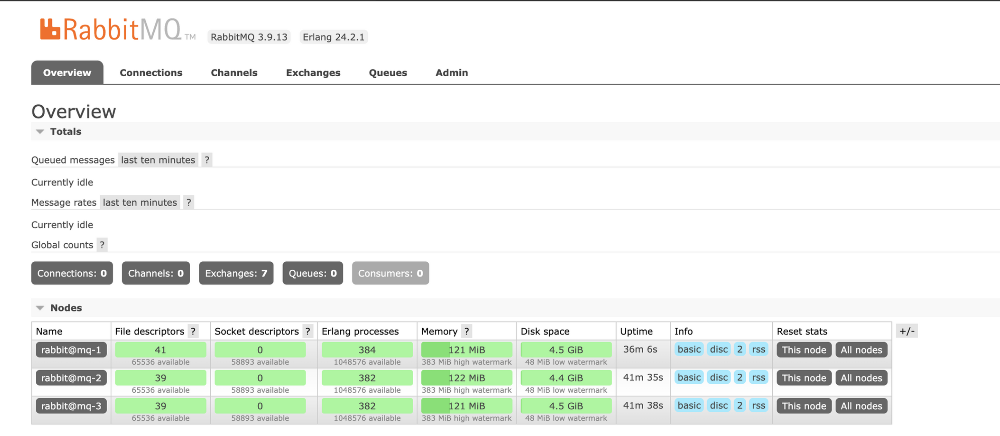
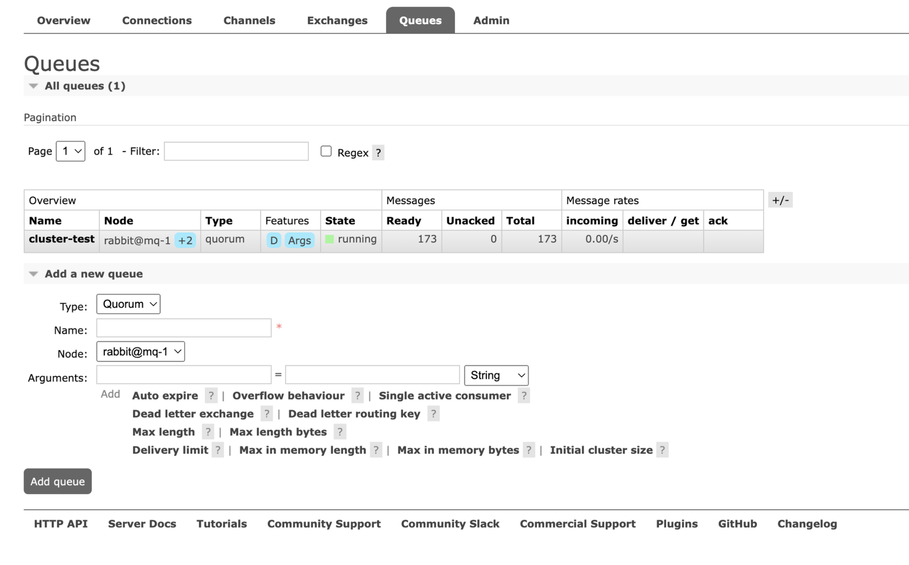
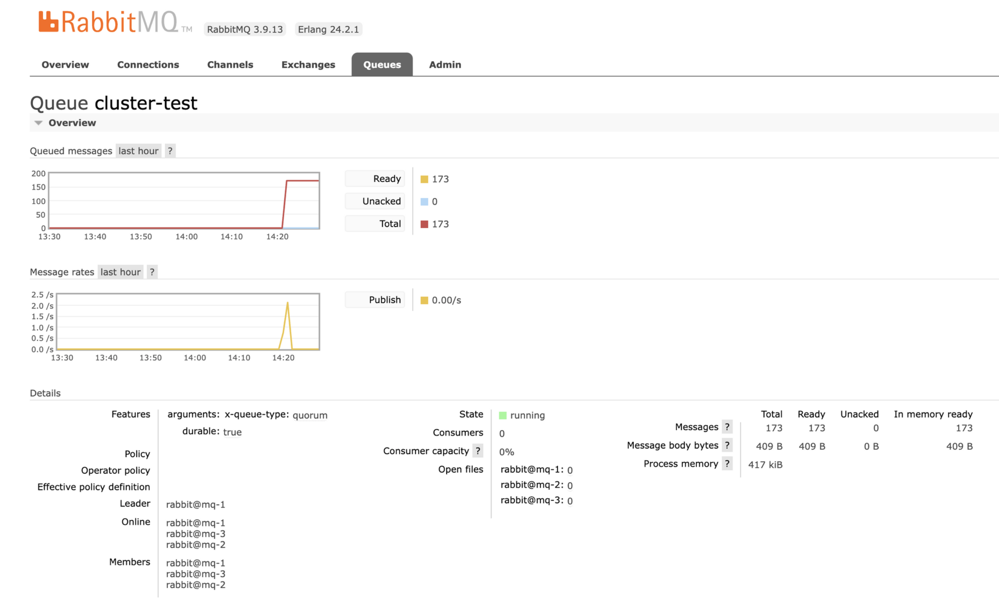
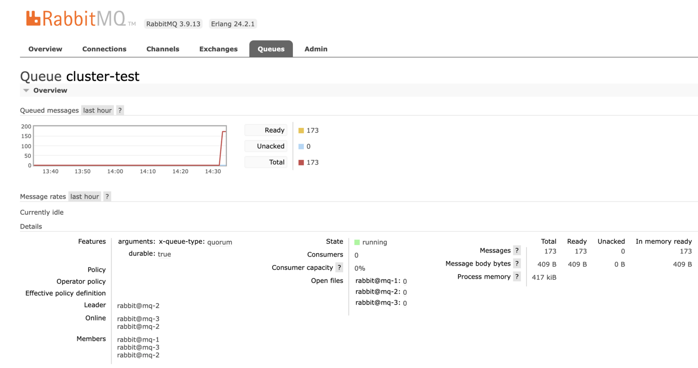
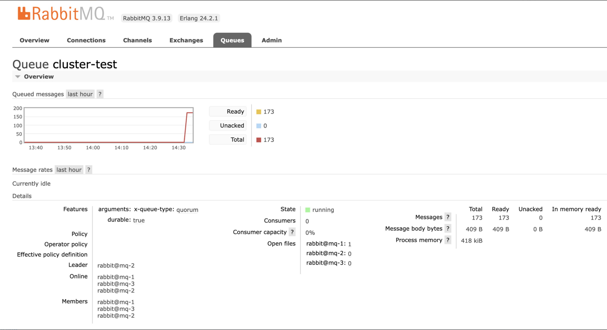
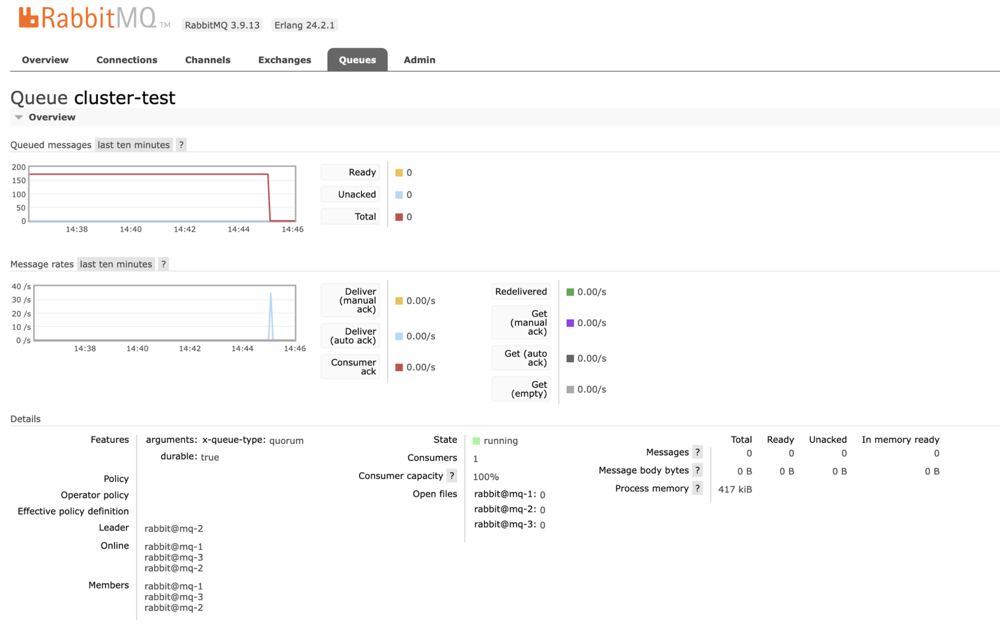

# RabbitMQ Cluster

고가용성 혹은 Throughput 을 늘리기 위해 클러스터를 맺을 수 있다. 여기서 다룰 것은 고가용성을 위한 부분이다. 

기존의 Classic Queue Mirroring 대신 Quorum Queue 를 활용하여 메시지를 분산 저장하는 클러스터 구조를 만들 수 있다.


## Quorum Queue
Quorum Queue는 RabbitMQ에서 높은 내구성과 데이터 일관성을 목적으로 설계된 큐 타입이다. 

다음과 같은 특징이 있다.


- 분산 복제: Quorum Queue는 Raft 합의 알고리즘을 사용하여 큐 데이터를 클러스터 내 여러 노드에 분산 복제한다. 이를 통해 개별 노드 장애가 발생해도 메시지 손실 없이 시스템이 계속 작동할 수 있다.

- 순차적 일관성: Quorum Queue는 메시지의 순서를 유지하고, 메시지는 항상 동일한 순서로 소비된다.

- 성능 최적화: Quorum Queue는 대규모 워크로드에 대해 Classic Queue Mirroring 에 비해 더 적은 리소스를 사용하도록 최적화되어 있다. 또한, 메시지 TTL(Time to Live), 데드 레터 큐 등의 기능도 제공한다.

- 설정 간소화: Quorum Queue는 구성을 간소화하고, Classic Queue에서 발생할 수 있는 일부 구성 문제를 방지하는 데 초점을 맞추고 있다. 실제로 Classic Queue와 비교했을 때 설정이 매우 간편하다.

Quorum Queue를 사용하기 위해서는 RabbitMQ 클러스터가 필요하며, 이 클러스터 내에 적어도 3개 이상의 노드가 존재해야 한다. Raft 합의 알고리즘이 정상적으로 작동하려면 노드가 3개 이상이어야 하기 때문이다.

그러나, Quorum Queues는 Classic Queues에 비해 메시지 전송 속도가 다소 느릴 수 있으며, 이는 데이터 복제와 높은 내구성을 달성하기 위한 trade-off로 볼 수 있다. 따라서, 클러스터를 맺은 이후 Throughput 에 대해 테스트하여 확인해보는 것이 필요하다.

## Raft Algorithm
Raft 알고리즘은 분산 컴퓨팅 시스템에서 여러 노드 간의 합의를 이루는 데 사용되는 알고리즘이다. 

핵심 원칙은 다음과 같다.

- 리더 선출 (Leader Election): Raft 클러스터 내에는 한 시점에 하나의 노드만 리더로 동작한다. 나머지 노드들은 팔로워로 동작한다. 클러스터가 처음 시작될 때, 노드들은 서로간에 투표를 통해 리더를 선출한다. 리더가 실패하거나 네트워크 분할 등의 문제로 팔로워들과 연결이 끊어질 경우, 새로운 리더 선출 프로세스가 시작된다.

- 로그 복제 (Log Replication): 리더 노드는 클러스터에 변경(예: 새로운 데이터 추가)이 발생하면 이를 로그에 기록하고, 이 로그를 팔로워 노드들에게 복제한다. 팔로워들은 이 로그를 받아 자신들의 로그에 추가한다. 리더는 팔로워가 로그를 성공적으로 저장했음을 확인한 후에만 해당 로그 항목을 커밋 상태로 변경한다.

- 안정성과 일관성 (Safety and Consistency): Raft 알고리즘은 네트워크 지연, 패킷 손실, 노드 장애 등과 같은 분산 시스템의 문제 상황에서도 데이터의 일관성을 유지한다. 이를 위해 Raft는 로그 항목들의 커밋 여부를 명확히 정의하고, 노드 장애 시에도 안전한 리더 선출을 보장한다.

Raft 알고리즘이 널리 사용되는 이유 중 하나는 분산 시스템에서 합의 문제를 해결하는 과정을 상대적으로 단순하고 이해하기 쉽게 설명해주기 때문이다. Raft는 분산 데이터베이스, 메시징 시스템, 분산 로그 시스템 등 다양한 분산 시스템에서 합의 알고리즘으로 사용된다.

## Disk 모드 vs Ram 모드
- Disk 모드 (Disk Nodes):
    Disk 노드는 메시지를 디스크에 저장한다. 이렇게 하면 서버가 재시작되거나 노드가 다운될 경우에도 메시지가 보존된다.
    
    Disk 노드는 일반적으로 높은 내구성을 제공하며, RAM보다 많은 데이터를 저장할 수 있다.

    단, 디스크에 쓰기 때문에 RAM 노드에 비해 상대적으로 성능이 느릴 수 있다.

- RAM 모드 (RAM Nodes):
    RAM 노드는 메시지를 메모리에 저장한다. 이는 빠른 처리를 위해 최적화되어 있지만, 노드가 종료되면 메모리에 저장된 메시지가 손실될 수 있다.
    RAM 노드는 높은 처리량과 낮은 지연 시간을 위해 사용된다.
    RAM 노드는 제한된 메모리 용량 때문에 Disk 노드에 비해 적은 양의 데이터만 저장할 수 있다.

RabbitMQ 클러스터에서는 Disk 노드와 RAM 노드를 혼합하여 사용할 수 있다. 하지만 클러스터에는 메타데이터와 클러스터 상태를 유지하기 위해 적어도 하나 이상의 Disk 노드가 있어야 한다.

## 클러스터 구성

3개의 VM instance와 RabbitMQ의 Quorum Queue 를 활용하는 구성이다.

- 동일한 VPC 내부에 VM 3개를 할당해야 한다.
- 아래의 포트 목록을 inbound, outbound 모두 열어줘야 한다.
    - 1883: MQTT용 포트
    - 4369 : epmd, 여러 rabbitmq 서버끼리 서로를 찾을 수 있는 네임 서버 역할을 하는 데몬에서 사용
    - 5671, 5672 : AMQP 를 사용한 메시지 전달 - 5672가 기본
    - 25672 : inter-node 와 CLI Tool 연결
    - 15672 : HTTP API, Management UI
- RabbitMQ 설치
    - `sudo apt-get update`
    - `sudo apt-get install rabbitmq-server --assume-yes`
    - `sudo rabbitmq-plugins enable rabbitmq_management`
    - `sudo rabbitmq-plugins enable rabbitmq_mqtt`
- 각각 서버에 대해 1,2,3 으로 호스트 이름 변경
    - `sudo hostnamectl set-hostname mq-1`
    - `sudo hostnamectl set-hostname mq-2`
    - `sudo hostnamectl set-hostname mq-3`
- 모든 VM에서 호스트 파일에 각 노드의 ip 명시
    - `sudo vi /etc/hosts`
    - 아래와 같이 명시(ip는 예시)
        
        ```bash
        10.0.7.169 mq-1
        10.0.7.206 mq-2
        10.0.7.42 mq-3
        ```
        
    - 시스템 재시작
        - `sudo reboot`
- Erlang 쿠키 맞추기
    - mq-1 기준으로 맞춘다.
    - `sudo vi /var/lib/rabbitmq/.erlang.cookie` 에 있는 값을 mq-2, mq-3에도 명시
    - 변경후 rabbitmq 서비스를 재시작
        - `sudo systemctl restart rabbitmq-server`
- mq-2, mq-3을 mq-1의 클러스터로 등록
    - 아래 명령어는 mq-2, mq-3 에서만 작업
    - rabbitmq 중단
        - `sudo rabbitmqctl stop_app`
    - mq-1 에 클러스터로 등록
        - `sudo rabbitmqctl join_cluster rabbit@mq-1`
    - RAM 모드로 변경
        - `sudo rabbitmqctl change_cluster_node_type ram`
    - rabbitmq 재시작
        - `sudo rabbitmqctl start_app`
- 클러스터 상태 확인
    - `sudo rabbitmqctl cluster_status`
    - 대시보드를 통해서도 클러스터가 맺어진 것을 확인할 수 있다.
        
        
- Quorum Queue 생성
    - mq-1을 리딩 노드로 하여 Quorum Queue 를 생성
        
        
        
    - 클러스터 내에 존재하는 노드들이 메시지를 공유한다.
    
        
    
        
    
- 테스트를 위해 mq-1 을 종료해보자.
    - online 목록에서 rabbit@mq-1 이 빠진 것을 확인할 수 있다. 메시지는 그대로 남아있다. 또한 Leader Node가 mq-2로 바뀌었다.
    - 또한, Message 가 들어온 시간이 변경되었는데, 이는 메시지가 새로운 Lead Node로 복제되는 과정에서 메시지가 재전송된 것이다. 이는 메시지가 다른 노드에 이미 복제되었지만, 새 Lead Node가 해당 메시지를 인지하지 못한 경우 발생할 수 있다.
        
        
        
- 다시 mq-1을 살리면
    - online 목록에 rabbit@mq-1 이 다시 들어오는 것을 확인할 수 있다.
    
        
    
- 메시지를 consume 한다.
    
    

