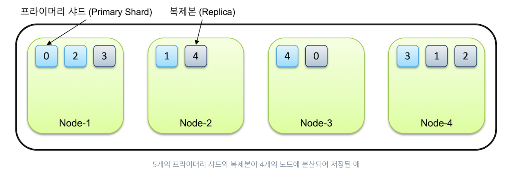

## 샤드
인덱스는 기본적으로 샤드(shard)라는 단위로 분리되고 각 노드에 분산되어 저장이 된다.

왜일까? 하나씩 짚어보자.

- 수평적 확장: 데이터와 트래픽 양이 증가하면 더 많은 노드를 클러스터에 추가하게 된다. 이 때, 샤드의 개념 덕분에 데이터를 재분배할 수 있으며, 이로 인해 클러스터 전체의 처리 능력과 스토리지 용량이 향상된다.
- 병렬 처리: 여러 노드에서 동시에 검색 및 인덱싱 작업을 병렬로 수행할 수 있다.
- 고가용성: 레플리카 샤드를 여러 노드에 분산 저장하기 때문에 특정 노드에 문제가 생기더라도 데이터가 유실 없이 운영이 가능하다.

샤드 구조를 가지게 되면 위와 같은 이점을 가질 수 있다.

그렇다면 샤드라는 논리적 구조가 어떻게 저장되는 것일까?

Elasticsearch의 베이스가 되는 Lucene은 디스크에 **세그먼트**라는 단위로 데이터와 인덱스 정보를 저장한다. 

세그먼트란 각 샤드 내부에서 데이터를 저장하고 관리하는 데 사용되는 불변의 인덱스 단위로, 새로운 데이터가 인덱싱될 때마다 새로운 세그먼트가 생성된다. 데이터가 수정되거나 삭제되면 실제로는 기존 세그먼트를 변경하는 것이 아니라, 특별한 마커를 사용하여 기록되며 나중에 병합 과정에서 반영된다. 이러한 세그먼트의 불변성 덕분에 잠금(lock) 메커니즘이 필요 없어 I/O 성능이 우수하다.

생겨난 작은 세그먼트들은 주기적으로 큰 세그먼트로 병합되게 되는데, 이로 인해 불필요하게 할당된 디스크가 정리되고 세그먼트의 개수가 줄어듦으로서 데이터 검색 성능이 향상된다. 