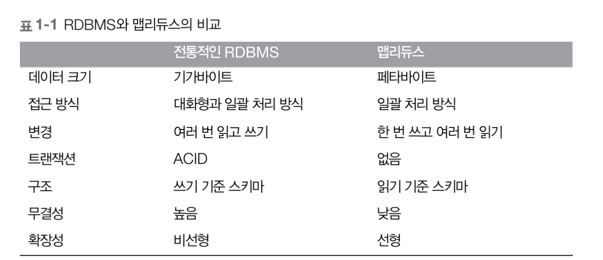
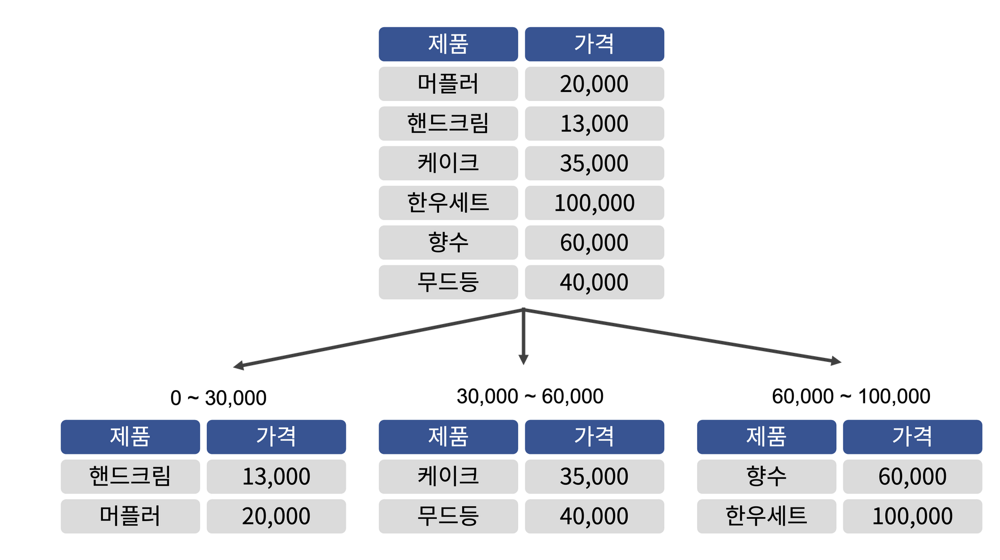
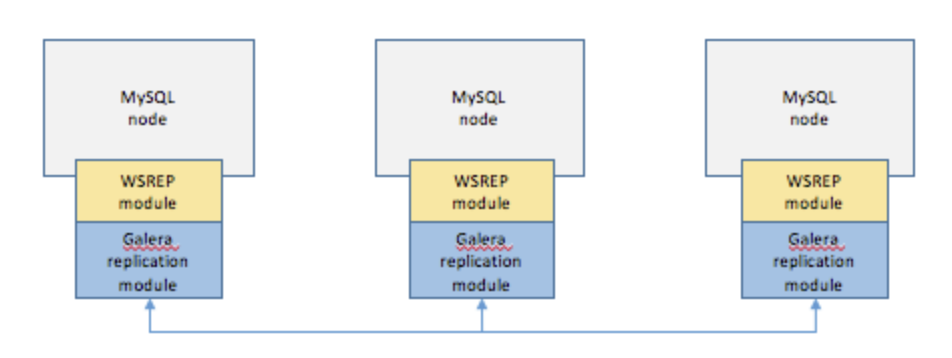

# why hadoop

데이터의 크기가 매우 커지고 있다. 2020년에는 10배 증가한 44제타바이트에 다다를 것으로 전망했다. 1제타바이트는 1조1000억 기가바이트이다.

데이터를 저장하는 디스크의 용량은 엄청나게 증가 했지만, 데이터 전송 속도의 증가는 그 수준에 마치지 못한다. 

그렇다면 데이터를 여러 디스크에 나눠 저장하고, 병렬로 읽어들이면 어떨까?

아이디어는 좋지만, 고려해야할 부분이 있다.
1. 하드웨어가 많아질수록 장애의 확률도 올라간다.
    - RAID?
        - 여러 곳에 데이터의 복사본이 보관되어 있으면 시스템 장애가 발생해도 다른 복사본을 바로 이용할 수 있다. -> 미러링?
    - HDFS?
2. 분할한 데이터를 결합해야 한다.
    - 맵 리듀스
        - 맵 리듀스의 강점은 기본적으로 일괄 처리 시스템이라는 것이고, 대화형 분석에는 적합하지 않다.

하둡 기반에서 작동되는 다양한 처리 패턴
- 대화형 SQL
- 반복 처리
- 스트림 처리
- 검색

DB를 이용하여 대규모 분석을 수행할 수는 없을까?

탐색 시간은 전송 속도보다 발전이 더디다.

RDB가 사용하는 B-트리는 재구성을 위해 Sort/Merge를 사용하므로 맵 리듀스보다 효율적이지 못하다.

-> 맵 리듀스는 데이터를 한 번 쓰고 여러 번 읽는 애플리케이션에 적합, RDB는 지속적으로 변경되는 데이터셋에 적합

그러나 RDB와 하둡의 차이가 점점 줄어들고 있다. 하둡 시스템의 하이브는 대화형으로 발전하고 있음, 인덱스나 트랜잭션과 같은 기능을 추가하고 있음.

하둡은 처리 시점에 데이터를 해석하도록 설계되어 있기 때문에 비정형 데이터나 반정현 데이터도 잘 처리할 수 있다. -> 읽기 시점 스키마(schema-on-read)

## HDFS vs RAID
- HDFS (Hadoop Distributed File System)

    여러 노드에서 데이터를 저장하고 처리하도록 설계되어 있는 분산 파일 시스템. 데이터를 여러 기기에 분산시켜 저장함으로써 대용량 데이터를 처리하고, 데이터의 고가용성을 유지하며, 하나 또는 그 이상의 노드가 실패할 경우에도 시스템이 계속 동작할 수 있다. HDFS는 빅데이터 처리에 특히 유용하며, MapReduce와 같은 프로그래밍 모델을 통해 대용량 데이터를 분산 처리하는 데 사용된다.

- RAID (Redundant Array of Independent Disks)

    여러 개의 디스크를 하나의 논리적 단위로 구성하여 데이터를 저장하는 기술. RAID는 데이터를 여러 디스크에 병렬로 저장함으로써 높은 I/O 성능을 제공하며, 디스크 장애에 대한 허용성을 향상시킨다. RAID는 여러 가지 수준 (RAID 0, 1, 5, 6 등)으로 구성될 수 있으며, 각 수준은 다른 성능, 데이터 보호 및 용량 확장성 특성을 제공한다.

요약하자면, HDFS와 RAID는 모두 데이터를 여러 디스크에 분산시켜 저장하나, 그 구현 방식과 사용 용도가 다르다. HDFS는 분산 컴퓨팅 환경에서 대용량 데이터를 처리하는 데 주로 사용되며, RAID는 한 시스템 내에서 디스크 성능을 향상시키고 데이터 손실을 방지하는 데 사용된다.

    Q. DB 에 비유하자면 HDFS는 샤딩같은거고 RAID는 클러스터 같은건가?

샤딩

클러스터링

    
    A. 비유적으로 설명하자면, 어느 정도 그럴 수 있습니다.

    HDFS는 샤딩(Sharding)에 비유될 수 있습니다. 둘 다 데이터를 여러 노드나 파티션으로 분할하여 처리하는 접근 방식을 취하고 있습니다. 샤딩에서는 하나의 데이터베이스를 여러 개의 서브세트(즉, 샤드)로 분할하며, HDFS에서는 파일을 여러 데이터 블록으로 분할하고 그 블록들을 여러 노드에 분산시킵니다. 둘 다 이런 방식으로 큰 규모의 데이터를 처리할 수 있게 되며, 각 노드나 샤드에서 병렬 처리를 수행할 수 있게 됩니다.

    RAID는 클러스터링(Clustering)에 비유될 수 있습니다. RAID에서는 여러 개의 디스크를 묶어 하나의 논리적 단위로 취급하며, 클러스터링에서는 여러 대의 서버를 묶어 하나의 데이터베이스로 취급합니다. 둘 다 이런 방식으로 데이터의 가용성을 높이고, 특정 하드웨어의 고장으로부터 시스템을 보호합니다.

    그러나 이 비유가 완벽하게 맞는 것은 아닙니다. 예를 들어, HDFS는 자동 복제 기능을 통해 데이터의 내구성을 확보하는데, 이것은 일반적인 샤딩 구조에서는 별도로 구현해야 하는 기능입니다. 또한 RAID와 클러스터링의 목적은 비슷하지만, 구현 방식과 세부 작동 원리는 상당히 다릅니다. RAID는 일반적으로 하나의 물리적 시스템 내에서 운영되는 반면, 클러스터링은 여러 대의 서버가 네트워크를 통해 연결되는 구조입니다.

## 맵 리듀스
MapReduce는 대량의 데이터를 처리하는 데에 매우 효과적인 프로그래밍 모델이며, 구글이 개발하고, 하둡 등 다양한 분산 컴퓨팅 시스템에서 사용되고 있다. 이 모델은 '맵(Map)' 단계와 '리듀스(Reduce)' 단계로 구성되어 있다.

- Map 단계: 이 단계에서는 입력 데이터를 처리하고 중간 키-값 쌍을 생성합니다. 맵 함수는 입력을 받아서 이를 처리하고, 그 결과로 여러 키-값 쌍을 생성합니다. 이 때, 동일한 종류의 데이터에 대해서는 동일한 키를 사용하게 됩니다. 맵 단계는 데이터를 병렬로 처리할 수 있으며, 이는 분산 환경에서 매우 효과적입니다. 예를 들어, "Hello, World!"라는 문장이 있다면, 이 단계에서는 ("Hello", 1), ("World", 1)라는 중간 결과를 생성합니다.

- Reduce 단계: 리듀스 단계에서는 맵 단계에서 생성된 모든 중간 키-값 쌍을 받아서 각 키에 해당하는 값들을 합칩니다. 즉, 리듀스 함수는 동일한 키를 가진 모든 값들을 처리하고, 그 결과를 합치는 작업을 수행합니다. 리듀스 단계는 데이터를 축소하고 요약하는 데 사용됩니다. 이 단계에서는 텍스트를 단어로 분리하고, 각 단어에 대해 (단어, 1) 쌍을 생성합니다. 예를 들어, 맵 단계에서 ("Hello", 1), ("World", 1), ("Hello", 1)이라는 결과가 나왔다면, 이를 ("Hello", 2), ("World", 1)로 축소합니다.

Q. 그래서 맵 리듀스가 왜 빠른것인가?

    A.
    - 병렬 처리: MapReduce는 작업을 여러 작은 서브태스크로 나누고, 이를 병렬로 처리합니다. 이는 대규모 데이터 세트를 빠르게 처리하는 데 매우 유리하며, MapReduce의 핵심적인 성능 향상 기능 중 하나입니다.

    - 데이터 지역성: MapReduce는 가능한 한 데이터를 읽는 비용을 줄이기 위해 "데이터 지역성" 원칙을 따릅니다. 이는 데이터를 처리하는 작업을 가능한 한 해당 데이터가 저장된 위치에 가깝게 배치하려는 것을 의미합니다. 이로 인해 네트워크 지연 시간이 - 크게 줄어들고 성능이 향상됩니다.

Q. SQL은 병렬 처리가 안되나?

    A. 
    SQL은 데이터베이스 질의 언어로, 단독으로 병렬 처리 기능을 제공하지는 않습니다. 그러나 많은 현대 데이터베이스 관리 시스템(DBMS)은 SQL 질의를 병렬로 처리할 수 있는 기능을 제공합니다. 이는 대용량 데이터를 빠르게 처리하거나 복잡한 질의를 최적화하는 데 매우 유용합니다.

    다음은 SQL 질의를 병렬로 처리하는 데 사용되는 몇 가지 방법입니다:

    병렬 스캔: 데이터베이스 테이블의 모든 레코드를 스캔하는 작업은 종종 CPU 및 I/O 집약적입니다. 많은 DBMS는 이러한 작업을 여러 쓰레드 또는 프로세스에 분산시켜 병렬로 실행할 수 있습니다.

    분할과 병합: 일부 DBMS는 큰 테이블을 여러 '파티션'으로 분할하고, 각 파티션에 대한 작업을 독립적으로 수행합니다. 이렇게 하면 복잡한 질의를 여러 작은 작업으로 나눌 수 있으며, 이를 병렬로 실행할 수 있습니다.

    복제: 읽기 집중적인 워크로드의 경우, 데이터베이스의 복제본을 여러 개 만들어 병렬로 읽기 작업을 수행할 수 있습니다. 이 방법은 데이터베이스의 읽기 성능을 크게 향상시킬 수 있습니다.

    분산 데이터베이스: 일부 데이터베이스 시스템은 여러 노드에 걸쳐 데이터를 분산시키고, 각 노드에서 병렬로 질의를 처리합니다. 이는 대규모 데이터 세트를 빠르게 처리하는 데 효과적입니다.

    따라서 SQL 자체는 병렬 처리를 지원하지 않지만, 많은 DBMS는 SQL 질의를 병렬로 처리할 수 있는 다양한 기능을 제공합니다. 이는 DBMS의 종류, 구성, 사용하는 하드웨어 등에 따라 다릅니다.

Q. 그러면, DB도 분산처리가 가능하단건데.. 하둡이 더 나은 이유가 뭐야

    A. 
    하둡이 RDBMS에 비해 대용량 데이터 처리에 유리한 이유는 여러 가지입니다:

    스케일 아웃: 하둡은 데이터를 여러 노드에 분산시켜 저장하고, 이를 병렬로 처리함으로써 처리량을 늘릴 수 있습니다. 새로운 노드를 추가함으로써 시스템의 용량과 처리 능력을 증가시킬 수 있습니다(스케일 아웃). 반면에 RDBMS의 경우 일반적으로 높은 성능의 서버를 추가하여 시스템의 처리 능력을 향상시키는 방식을 사용합니다(스케일 업). 이는 비용이 많이 들고, 일정 규모 이상으로는 확장이 어렵습니다.

    비정형 데이터 처리: 하둡은 비정형 데이터를 더 쉽게 처리할 수 있습니다. 반면에 RDBMS는 주로 정형 데이터에 적합하며, 비정형 데이터를 처리하려면 데이터를 먼저 정형화해야 합니다.

    비용 효율성: 하둡은 상대적으로 저렴한 커뮤니티 하드웨어를 사용하여 대규모 데이터를 처리할 수 있습니다. 반면에 RDBMS는 종종 고가의 서버와 스토리지 시스템이 필요하며, 이에 따른 라이선스 비용도 부담해야 합니다.

    내고장성: 하둡은 데이터를 여러 노드에 복제하여 저장하므로, 한 노드가 실패해도 데이터의 손실이나 시스템의 다운 없이 작업을 계속할 수 있습니다.

    쿼리 최적화의 복잡성: RDBMS에서 샤딩을 구현하면 쿼리 최적화 및 데이터 관리가 복잡해질 수 있습니다. 각 샤드에 대해 쿼리를 실행하고 결과를 집계해야 하며, 데이터 분포 및 밸런싱도 신경 써야 합니다.