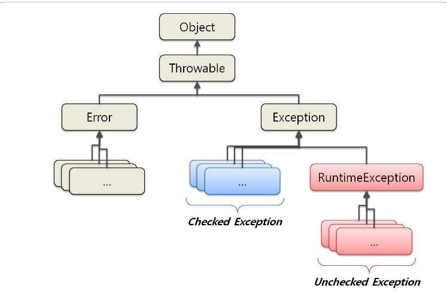

# Exception

## Checked Exception
Checked Exception 은 `RuntimeException`의 하위 클래스가 아니면서 `Eception` 클래스의 하위 클래스이다.

해당 예외들은 반드시 에러 처리를 해야하는 특징(try/catch or throw)를 가지고 있다.

ex) `FileNotFoundException`, `ClassNotFoundException`

## Unchecked Exception
Unchecked Exception 은 `RuntimeException`의 하위 클래스들이다. 

해당 예외들은 `CheckedException` 과는 달리 에러 처리를 강제하지 않는다.

ex) `ArrayIndexOutOfBoundsException`, `NullPointerException`