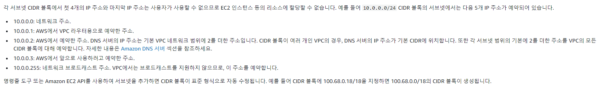

VPC의 첫번째 IP는 내부 트래픽 라우터용, 두 번째 IP는 DNS 서버이다.

예: CIDR이 10.1.0.0/16인 VPC

`10.1.0.1` -> 라우터

`10.1.0.2` -> DNS 서버

`10.1.0.3` -> aws 에서 사용하려고 예약한 주소

### 문제 상황
10.1.0.0/16인 VPC내 10.1.0.5의 IP를 가진 인스턴스에서 DNS가 안됨 -> 확인해보니 내부에 10.1.0.1 IP의 Docker 가상 네트워크 인터페이스가 있었음

즉, DNS 질의 포함한 내부 트래픽이 VPC 라우터로 가지 못하고 인스턴스 내 가상 NIC으로 갔기 때문에 에러 발생.

ip충돌뿐 아니라, 아웃 바운드 방화벽 역시 문제가될 수 있으니 조심해야한다.