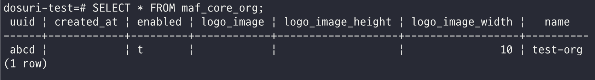

## Nested Transaction
비즈니스 요구사항에 따라, 중첩 트랜잭션을 사용할 일이 생겼다.

플로우는 다음과 같다.

1. Outer 트랜잭션 시작
2. DB 조회를 통해 사용할 레코드 선정
3. Inner 트랜잭션 시작
4. 사용할 레코드 DB의 값 변경을 통해 선점(동시에 들어오는 요청이 해당 레코드를 선점하지 못하도록)
5. Inner 트랜잭션 종료
6. 로직 실행(외부 API 호출 등)
7. Outer 트랜잭션 종료

여기서 4번이 문제인데, DB의 값을 변경해야 하기 때문에 Outer 트랜잭션과는 별도의 트랜잭션으로 독립적인 동작을 해야 한다.

스프링에서 제공하는 `@Transactional` 어노테이션을 사용하면 트랜잭션을 할당할 수 있는데, 트랜잭션 메소드 내에서 또 다른 트랜잭션 메소드를 호출하게 되면 propagation 레벨을 지정하지 않은 경우 트랜잭션 전이에 의해 하나의 트랜잭션으로 묶이게 된다.

그래서 이러한 경우 propagtion 레벨을 `REQUIRES_NEW`로 지정해주어야 한다.

```Java
@Transactional
    public void outerTransaction(Org org) throws RuntimeException{
        org.setLogoImageHeight(10);

        tempInnerTransactionService.innerTransaction(org);

        ... 추가 비즈니스 로직
    }

@Transactional(propagation = Propagation.REQUIRES_NEW)
    public void innerTransaction(Org org) throws RuntimeException {
        org.setLogoImageWidth(10);
        orgRepository.save(org);
        System.out.println("Inner Save");
    }
```

위와 같은 예제에서, outer 트랜잭션은 `ImageHeight` 라는 값을 10으로 변경하고 inner 트랜잭션은 `ImageWidth` 라는 값을 10으로 변경한다.

jpa는 레코드의 값을 변경할 때 변경감지라는 기능을 통해 save등의 메소드 호출 없이 `update` 쿼리를 날리도록 되어 있다. 그러나 위의 경우 inner 트랜잭션이 별도의 트랜잭션에서 작동되고, 영속성 컨텍스트 역시 별도여서 파라미터로 넘겨주는 org의 변경을 감지할 수가 없다.

따라서 `save` 메소드를 호출하여 `save` 내부적으로 발생하는 `merge`를 통해 영속성 컨텍스트를 합쳐줘야 한다. 

그런데 이렇게 작성하고 테스트를 해보니, outer 트랜잭션의 변경 값까지 감지가되어 `update` 쿼리가 날아가는 것을 확인할 수 있었다.

또한, `merge`를 위해 `select` 동일한 쿼리가 한 번 더 날아가는 것으로 보인다.
```
Hibernate: 
    select
        o1_0.uuid,
        o1_0.created_at,
        o1_0.enabled,
        o1_0.logo_image,
        o1_0.logo_image_height,
        o1_0.logo_image_width,
        o1_0.name 
    from
        maf_core_org o1_0
Hibernate: 
    select
        o1_0.uuid,
        o1_0.created_at,
        o1_0.enabled,
        o1_0.logo_image,
        o1_0.logo_image_height,
        o1_0.logo_image_width,
        o1_0.name 
    from
        maf_core_org o1_0 
    where
        o1_0.uuid=?
2023-09-17T14:33:31.408+09:00 TRACE 7572 --- [    Test worker] org.hibernate.orm.jdbc.bind              : binding parameter [1] as [VARCHAR] - [abcd]
First Inner Save
Hibernate: 
    update
        maf_core_org 
    set
        created_at=?,
        enabled=?,
        logo_image=?,
        logo_image_height=?,
        logo_image_width=?,
        name=? 
    where
        uuid=?
2023-09-17T14:33:31.424+09:00 TRACE 7572 --- [    Test worker] org.hibernate.orm.jdbc.bind              : binding parameter [1] as [TIMESTAMP] - [null]
2023-09-17T14:33:31.425+09:00 TRACE 7572 --- [    Test worker] org.hibernate.orm.jdbc.bind              : binding parameter [2] as [BOOLEAN] - [true]
2023-09-17T14:33:31.425+09:00 TRACE 7572 --- [    Test worker] org.hibernate.orm.jdbc.bind              : binding parameter [3] as [VARCHAR] - [null]
2023-09-17T14:33:31.425+09:00 TRACE 7572 --- [    Test worker] org.hibernate.orm.jdbc.bind              : binding parameter [4] as [INTEGER] - [10]
2023-09-17T14:33:31.426+09:00 TRACE 7572 --- [    Test worker] org.hibernate.orm.jdbc.bind              : binding parameter [5] as [INTEGER] - [10]
2023-09-17T14:33:31.426+09:00 TRACE 7572 --- [    Test worker] org.hibernate.orm.jdbc.bind              : binding parameter [6] as [VARCHAR] - [test-org]
2023-09-17T14:33:31.426+09:00 TRACE 7572 --- [    Test worker] org.hibernate.orm.jdbc.bind              : binding parameter [7] as [VARCHAR] - [abcd]
secondInnerTransaction Exception
```

아무래도 `merge`의 동작 방식을 제대로 이해하지 못하고 있는것 같은데, 이 부분은 다시 살펴봐야할 듯 하다.

위 문제는 아래와 같이, 엔티티 자체를 파라미터로 넘기지 않고 pk 등을 넘기는 방법으로 회피할 수 있다. pk를 넘기면, 해당 pk로 엔티티를 조회해올 때 inner 트랜잭션의 영속성 컨텍스트에 담기게 되고 변경감지가 가능하다.
```Java
@Transactional(propagation = Propagation.REQUIRES_NEW)
    public void innerTransaction(String orgUuid, int value) throws RuntimeException {
        Org foundOrg = orgRepository.findByUuid(orgUuid).get();
        foundOrg.setLogoImageWidth(10);
        if (value == 10) {
            throw new RuntimeException();
        }
    }
```

위와 같이 구성하면, inner 트랜잭션 이후에 Exception이 발생하여 Outer 트랜잭션이 롤백으로 마킹 되더라도 LogoWidth 값은 변경되지 않고 LogoHeight 값만 롤백된다.

